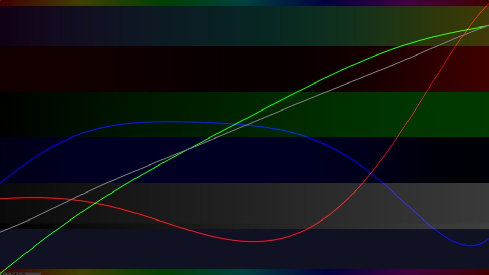
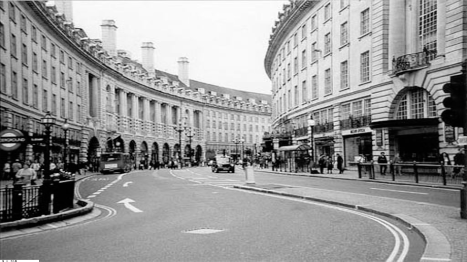
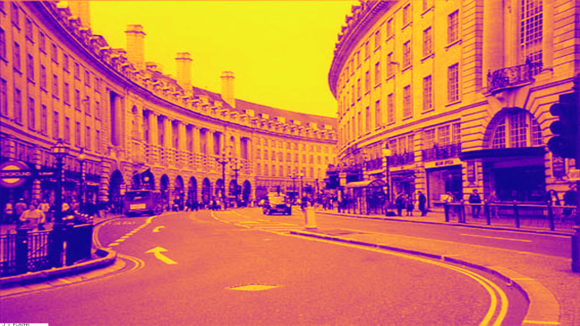

# Jet Color Mapping Comparison

[Demo](https://www.shadertoy.com/view/tc2SDw)

# Instructions

1. While holding down the left mouse button ...
   (The raw sRGB pre-gamma corrected image will be shown.)

2. ... move the mouse left/right to select the mode:

 * Left   1/3: photo mode
 * Middle 1/3: gradient mode
 * Right  1/3: RGB curves mode

3. ... move the mouse up/down to select the algorithm:

 * A. Jet (popularized MATLAB)
 * B. Turbo (Google)
 * C. Sine Jet (Michael Pohoreski)
 * D. EvalDraw (Ken Silverman)
 * E. Hot Cold
 * F. Sine Enigma (Michael Pohoreski)
 * G. Black & White (Perceived Lightness)
 * H. Inferno
 * I. Magma
 * J. Plasma
 * K. Parula (by wagyx and not MATHLAB's "propietary" color mapping. LUL.)
 * L. Viridus (open-source replacement for Parula)
 * M. Original image (Easter Egg)

The bars in gradient mode are:

1) Split into two:
   * HSV bar (narrow top strip), and
   * Color palette (wide bottom strip)
2) Red   channel of color palette
3) Green channel of color palette
4) Blue  channel of color palette
5) Split in two:
   * Percieved Lightness of the color palette (wide top strip), and
   * Linear brightness as  reference (narrow bottom strip)
6) Color "Sweep".
   There is a metronome that sweeps through the color palette.
   It is displayed a solid color.

The RGB color curves shows the red, green, blue contributions for the palette.

# Introduction

There are various ways to "false color" raw data.

First, we normalize the data.

By normalizing we mean remap the:

* lowest value to 0.0 (inclusive), and
* highest value to 1.0 (inclusive).

Second, we display the normalized data. Should we use:

* a grayscale image?
* a color image?

Unfortunately gray MAY make it hard to see SMALL delta changes.

If we show colors instead of gray this process is called "color mapping."

We normally have a palette (of 256 entries) that we can
"map" the normalized gray scale value to the closest color entry.

Remapping this gray scale to Light's wavelengths (~400nm to ~700nm)
produces a "rainbow" output.

A naive approach would be to map gray to HSV where Saturation=1, Value=1.

# Classic Jet Mapping

An (old) "de facto" standard in the scientic community was to false color
a grayscale image with a color mapping or palette called "Jet" or
"Rainbow" color mapping due to it looking like a rainbow.

It became popular due to MATLAB making it the default color map.

MATLAB defines several color maps:
* https://www.mathworks.com/help/matlab/ref/colormap.html

It is defined as a linear ramp between the following 9 colors:
```
   Stop  HexRGB   Color Float          Color Name
   0/8:  #00007F  vec3(0.0, 0.0, 0.5)  dark blue
   1/8:  #0000FF  vec3(0.0, 0.0, 1.0)  blue
   2/8:  #007FFF  vec3(0.0, 0.5, 1.0)  azure
   3/8:  #00FFFF  vec3(0.0, 1.0, 1.0)  cyan
   4/8:  #7FFF7F  vec3(0.5, 1.0, 0.5)  light green
   5/8:  #FFFF00  vec3(1.0, 1.0, 0.0)  yellow
   6/8:  #FF7F00  vec3(1.0, 0.5, 0.0)  orange
   7/8:  #FF0000  vec3(1.0, 0.0, 0.0)  red
   8/8:  #7F0000  vec3(0.5, 0.0, 0.0)  dark red
```
An naive algorithm that implements the Jet color remapping is:

```glsl
    // Author: Michael Pohoreski
    // CC0 version
    vec3 Map_Jet_MATLAB( float t )
    {
        const vec3 K0 = vec3(0.0, 0.0, 0.5);
        const vec3 K1 = vec3(0.0, 0.0, 1.0);
        const vec3 K2 = vec3(0.0, 0.5, 1.0);
        const vec3 K3 = vec3(0.0, 1.0, 1.0);
        const vec3 K4 = vec3(0.5, 1.0, 0.5);
        const vec3 K5 = vec3(1.0, 1.0, 0.0);
        const vec3 K6 = vec3(1.0, 0.5, 0.0);
        const vec3 K7 = vec3(1.0, 0.0, 0.0);
        const vec3 K8 = vec3(0.5, 0.0, 0.0);
        const float w = 1./8.;
        /* */ vec3  c = vec3(0);
        
        /**/ if (t < 1./8.) { c = mix( K0, K1, 8.*(t - (0./8.) ); }
        else if (t < 2./8.) { c = mix( K1, K2, 8.*(t - (1./8.) ); }
        else if (t < 3./8.) { c = mix( K2, K3, 8.*(t - (2./8.) ); }
        else if (t < 4./8.) { c = mix( K3, K4, 8.*(t - (3./8.) ); }
        else if (t < 5./8.) { c = mix( K4, K5, 8.*(t - (4./8.) ); }
        else if (t < 6./8.) { c = mix( K5, K6, 8.*(t - (5./8.) ); }
        else if (t < 7./8.) { c = mix( K6, K7, 8.*(t - (6./8.) ); }
        else /*          */ { c = mix( K7, K8, 8.*(t - (7./8.) ); }
    
        return clamp( c, vec3(0), vec3(1) );
    }
```

All those branches are HORRIBLE for performance on a GPU.
Joshua Fraser has a version that is native/performant in GLSL:

```glsl
    // Author: Joshua Fraser
    // https://stackoverflow.com/a/46628410
    vec3 Map_Jet_JoshuaFraser( float t )
    {
        return clamp((vec3(1.5) - abs(4.0*vec3(t) + vec3(-3,-2,-1))), 0., 1.);
    }
```

I first came across Jet color mapping with Peter Bennett's blog ...

  "OpenGL Minecraft Style Volume Rendering"
  * http://bytebash.com/2012/03/opengl-volume-rendering/
  * https://web.archive.org/web/20130111133715/http://bytebash.com/2012/03/opengl-volume-rendering/

... where he implemented the Jet Mapping.

>    "In addition to this, I also wrote a fragment shader in GLSL which
>     colours each block in the volume based on its vertical position
>     using the common jet colour mapping:"

```glsl
    //VALUE in this case is the y position of the block and ranges from 0 to 255
    float k = 4*(VALUE/float(255));
    float red = clamp(min(k - 1.5, -k + 4.5),0.0,1.0);
    float green = clamp(min(k - 0.5, -k + 3.5),0.0,1.0);
    float blue  = clamp(min(k + 0.5, -k + 2.5),0.0,1.0);
```

We can clean that up to be a little more readable:

```glsl
    // Author: Peter Bennett
    // Cleanup: Michael Pohoreski
    vec3 Map_Jet_PeterBennett( float t )
    {
        float k = 4.0 * t;
        float r = min( k - 1.5, -k + 4.5);
        float g = min( k - 0.5, -k + 3.5);
        float b = min( k + 0.5, -k + 2.5);
        return clamp(vec3(r,g,b), 0.0, 1.0);
    }
```

# Sine Jet Mapping

If look at the color curves for Jet we notice that they
crudely look like sine waves with a phase shift and then shifted up.

```glsl
    vec3 Map_SineJet_MichaelPohoreski( float t )
    {
        float rad =              t  * M_TAU   ;
        float r = sin( rad + (2./4. * M_TAU) );
        float g = sin( rad + (3./4. * M_TAU) );
        float b = sin( rad + (0./4. * M_TAU) );
        return 0.5 + 0.5*vec3(r,g,b);
    }
```

# Hot To Cold Mapping

If we "relax" the ends of the Jet color mapping so they are "held high":

 * Blue remains at 1.0 from t = [0.0   .. 0.125]
 * Red  remains at 1.0 from t = [0.875 .. 1.0  ]

We can simplify the equations. This is the "Hot To Cold" mapping.

Unfortunately this is naive since it causes loss of fidelity:

* under-exposure (lows)
* over-exposure (highs)

Regardless, the color curves looks this:

```
RGB:

      -0.5    +0.5
        |       |
        v       v
    BBBBBGGGGGGGRRRRR  1.00
    ...G.B.....R.G...  0.75
    ..G...R...R...G..  0.50
    .G.....B.R.....G.  0.25
    GRRRRRRRR.......G  0.00
    ^       ^       ^
    -1      0      +1

Red:

      -0.5    +0.5
        |       |
        v       v
    ............RRRRR  1.00
    ...........R.....  0.75
    ..........R......  0.50
    .........R.......  0.25
    RRRRRRRRR........  0.00
    ^       ^ ^     ^
    -1      0 |    +1
            +0.25

Green:

      -0.5    +0.5
        |       |
        v       v
    ....GGGGGGGGG....  1.00
    ...G.........G...  0.75
    ..G...........G..  0.50
    .G.............G.  0.25
    G........+......G  0.00
    ^       ^       ^
    -1      0      +1


Blue:

      -0.5    +0.5
        |       |
        v       v
    BBBBB............  1.00
    .....B...........  0.75
    ......B..........  0.50
    .......B.........  0.25
    ........BBBBBBBBB  0.00
    ^     ^ ^       ^
    -1    | 0      +1
        -0.25
```

It can implemented in a few ways, the simpliest is probably naively.

We can re-write it as this GLSL one-liner:

```glsl
    vec3 Map_HotToCold_MichaelPohoreski( float t )
    {
        return clamp((vec3(2.0) - abs(4.0*vec3(t) - vec3(4,2,0))), 0., 1.);
    }
```

Alternatively, this can be optimized for GPUs by modifying standard hue2rgb!

If have this hue2rgb function that implements HSV when S=1 and V=1 ...

```glsl
    hue2rgb( float angle )
    {
        return clamp(abs(fract(vec3(a)+vec3(3,2,1)/3.)*6. - 3.) - 1., 0., 1.);
    }
```

... then we can get the HotCold coloring via a simple phase shift!

```glsl
    vec3 Map_HotToCold_MichaelPohoreski_Hue( float t )
    {
        return hue2rgb( (1.-t)*2./3. );
    }
```

# "Turbo"

Good made a Jet replacement with polynomial approximation to have
more uniform brightness.

Unfortunately it has the same problems as Jet.

# Pics

## Thumbnails

| Color Map | Gradients | Curves |
|:--|:--|:--|
|             | ---                                               | ---                                            |
|         |     |     |
|       |      |      |
|    |      |      |
|     |       |       |
| |     |     |
|          |          |          |
|     | | |
|       |     |     |
|      |    |    |
|      |       |       |
|     |         |         |

## Full Resolution

* [Original              ](pic/thumbs/original.png)
* [Colormap Jet          ](pics/colormap_jet.png)        , [Gradients Jet          ](pics/gradients_jet.png)        , [Curves Jet          ](pics/curves_jet.png)
* [Colormap Turbo        ](pics/colormap_turbo.png)      , [Gradients Turbo        ](pics/gradients_turbo.png)      , [Curves Turbo        ](pics/curves_turbo.png)
* [Colormap Sine Jet     ](pics/colormap_sine_jet.png)   , [Gradients              ](pics/gradients_sine_jet.png)   , [Curves Sine Jet     ](pics/curves_sine_jet.png)
* [Colormap Hot Cold     ](pics/colormap_hotcold.png)    , [Gradients Hot Cold     ](pics/gradients_hotcold.png)    , [Curves Hot Cold     ](pics/curves_hotcold.png)
* [Colormap Sine Enigma  ](pics/colormap_sine_enigma.png), [Gradients Sine Enigma  ](pics/gradients_sine_enimga.png), [Curves Sine Enigma  ](pics/curves_sine_enimga.png)
* [Colormap Black & White](pics/colormap_bw.png)         , [Gradients Black & White](pics/gradients_bw.png)         , [Curves Black & White](pics/curves_bw.png)
* [Colormap Inferno      ](pics/colormap_inferno.png)    , [Gradients Inferno      ](pics/gradients_inferno.png)    , [Curves Inferno      ](pics/curves_inferno.png)
* [Colormap Magma        ](pics/colormap_magma.png)      , [Gradients Magma        ](pics/gradients_magma.png)      , [Curves Magma        ](pics/curves_magma.png)
* [Colormap Plasma       ](pics/colormap_plasma.png)     , [Gradients Plasma       ](pics/gradients_plasma.png)     , [Curves Plasma       ](pics/curves_plasma.png)
* [Colormap Parula       ](pics/colormap_parula.png)     , [Gradients Parula       ](pics/gradients_parula.png)     , [Curves Parula       ](pics/curves_parula.png)
* [Colormap Viridus      ](pics/colormap_viridus.png)    , [Gradients Viridus      ](pics/gradients_viridus.png)    , [Curves Viridus      ](pics/curves_viridus.png)

# Also see

## Uber Colormaps
* https://matplotlib.org/stable/users/explain/colors/colormaps.html
* https://matplotlib.org/thirdpartypackages/#colormaps-and-styles
* https://github.com/kbinani/colormap-shaders
* Smaller subset GLSL Colormap JPG
  https://github.com/glslify/glsl-colormap
* Small sampling
  https://github.com/jgreitemann/colormap
* Scientific Color maps
  https://www.fabiocrameri.ch/colourmaps/

## Jet
* https://stackoverflow.com/questions/7706339/grayscale-to-red-green-blue-matlab-jet-color-scale
* https://gorelik.net/2020/08/17/what-is-the-biggest-problem-of-the-jet-and-rainbow-color-maps-and-why-is-it-not-as-evil-as-i-thought/
* Spectral Colour Schemes
  https://www.shadertoy.com/view/ls2Bz1
* Alan Zucconi's Blog
  Improving the Rainbow
  https://www.alanzucconi.com/2017/07/15/improving-the-rainbow/
  Improving the Rainbow – Part 2
  https://www.alanzucconi.com/2017/07/15/improving-the-rainbow-2/
* https://gist.github.com/mikhailov-work/0d177465a8151eb6ede1768d51d476c7
* https://github.com/kbinani/colormap-shaders/blob/master/shaders/glsl/MATLAB_jet.frag
* https://blogs.egu.eu/divisions/gd/2017/08/23/the-rainbow-colour-map/

## MATLAB Blogs
* https://blogs.mathworks.com/loren/2007/01/10/colormap-manipulations/
* https://blogs.mathworks.com/steve/2014/10/13/a-new-colormap-for-matlab-part-1-introduction/
* https://blogs.mathworks.com/steve/2014/10/20/a-new-colormap-for-matlab-part-2-troubles-with-rainbows/
* https://blogs.mathworks.com/steve/2014/11/12/a-new-colormap-for-matlab-part-3-some-reactions/
* https://blogs.mathworks.com/steve/2017/07/24/colormap-test-image/
* https://blogs.mathworks.com/steve/category/colormap/?s_tid=Blog_steve_Category

## Better Color Maps
* matplotlib colormaps
  https://www.shadertoy.com/view/WlfXRN

* https://github.com/BIDS/colormap/blob/master/colormaps.py
* https://bids.github.io/colormap/
* https://bids.github.io/colormap/images/screenshots/jet.png

## Divergent Color Ramps/Palettes
* https://stackoverflow.com/questions/37482977/what-is-a-good-palette-for-divergent-colors-in-r-or-can-viridis-and-magma-b

##Parula
* A Better Default Colormap for Matplotlib | SciPy 2015 | Nathaniel Smith and Stéfan van der Walt
  https://www.youtube.com/watch?v=xAoljeRJ3lU

* Parula Matlab Colormap
  https://www.shadertoy.com/view/ddBSWG

* matplotlib colormaps + turbo
  https://www.shadertoy.com/view/3lBXR3

* https://mathematica.stackexchange.com/questions/161647/how-to-mimic-matlab-parula-color-scheme-efficiently

## Turbo
* https://research.google/blog/turbo-an-improved-rainbow-colormap-for-visualization/

## Viridis
* "Why you should use Viridis and not Jet (rainbow) as a colormap"
  * https://www.domestic-engineering.com/drafts/viridis/viridis.html
  NOTE: This has a LOT of mistakes in it!

  Image:
  * https://www.domestic-engineering.com/drafts/viridis/faces.svg
* "Somewhere Over the Rainbow: An Empirical Assessment of Quantitative Colormaps"
* https://cran.r-project.org/web/packages/viridis/vignettes/intro-to-viridis.html
* https://observablehq.com/@flimsyhat/webgl-color-maps
* https://blog.habrador.com/2023/04/colormaps-overview-code-implementations-rainbow-virids.html

## SDF Sine Wave
* Sine Wave with smoothstep
  https://www.shadertoy.com/view/mscXz4

# Tags

Tags: jet, viridus, parula, plasma, magma, inferno, turbo, hot2cold, rainbow, colormap, colorramp, falsecolor, spectrum, palette

March 14, 2025.
